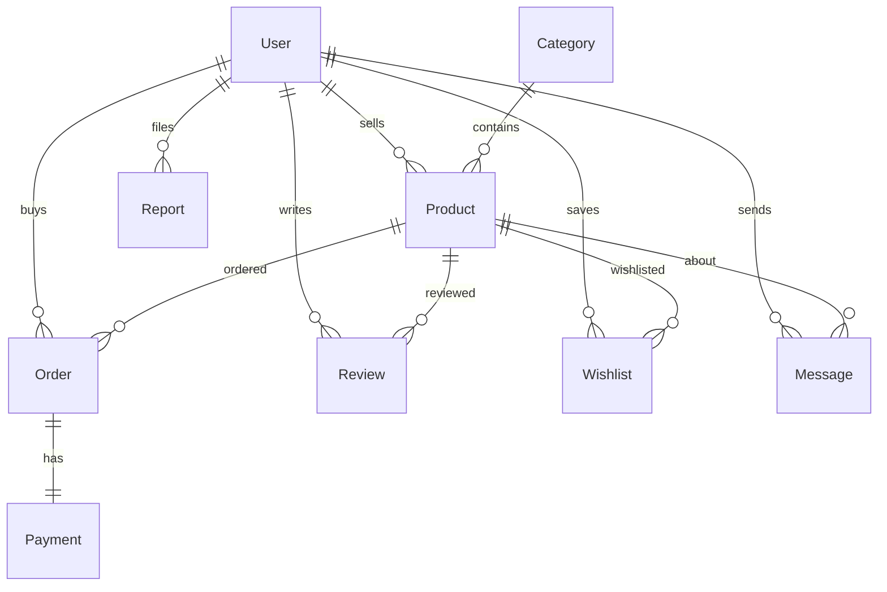

# ✦ Campusino

> **Your Campus. Your Market.** — A premium marketplace for college students to buy, sell, and rent products.


---

## ✨ Features

- 🛒 **Buy & Sell** — List products for sale or rent with detailed descriptions
- 🔍 **Search & Filter** — Real-time search with category-based filtering
- 💬 **Messaging** — Chat directly with buyers and sellers
- ⭐ **Reviews** — Rate and review purchased products
- ❤️ **Wishlist** — Save products for later
- 🛡️ **Reporting** — Report suspicious listings
- 👤 **User Profiles** — Track your listings, purchases, and reviews
- 🔐 **Authentication** — Secure login/register with password hashing
- 🌙 **Dark Mode UI** — Premium glassmorphism design

---

## 🛠️ Tech Stack

| Layer | Technology |
|-------|-----------|
| **Backend** | Flask, Flask-SQLAlchemy, Flask-Login |
| **Database** | SQLite |
| **Frontend** | Jinja2, Custom CSS, JavaScript |
| **Auth** | Werkzeug (password hashing) |
| **Deployment** | Render (gunicorn) |

---

## 🚀 Quick Start

### Prerequisites
- Python 3.10+

### Setup

```bash
# Clone the repository
git clone https://github.com/Sankalpthissi6e/Campusino.git
cd Campusino

# Create virtual environment
python -m venv venv
venv\Scripts\activate   # Windows
# source venv/bin/activate  # macOS/Linux

# Install dependencies
pip install -r requirements.txt

# Initialize database with sample data
python setup_db.py

# Run the application
python app.py
```

Visit **http://127.0.0.1:5000** in your browser.

### Test Accounts

| Email | Password | Role |
|-------|----------|------|
| `rahul@gmail.com` | `12345` | User |
| `admin@gmail.com` | `admin123` | Admin |

---

## 📁 Project Structure

```
Campusino/
├── app.py              # Flask application & routes
├── models.py           # SQLAlchemy database models
├── setup_db.py         # Database initialization with sample data
├── init_db.py          # Alternative DB init script
├── schema.sql          # Raw SQL schema (DDL, views, triggers)
├── queries.sql         # Sample SQL queries
├── test_app.py         # Pytest unit tests
├── requirements.txt    # Python dependencies
├── static/
│   ├── css/style.css   # Premium dark-mode design system
│   └── js/main.js      # Animations & interactivity
└── templates/
    ├── base.html       # Base layout with navbar & footer
    ├── index.html      # Homepage with hero & product grid
    ├── login.html      # Login page
    ├── register.html   # Registration page
    ├── product_detail.html  # Product detail with reviews
    ├── add_product.html     # Add/list product form
    ├── orders.html     # Order tracking (purchases & sales)
    ├── wishlist.html   # Saved products
    ├── messages.html   # Messaging system
    ├── report.html     # Report a listing
    ├── profile.html    # User profile & stats
    └── 404.html        # Custom error page
```

---

## 🗄️ Database Schema



---

## 🧪 Testing

```bash
python -m pytest test_app.py -v
```

---
